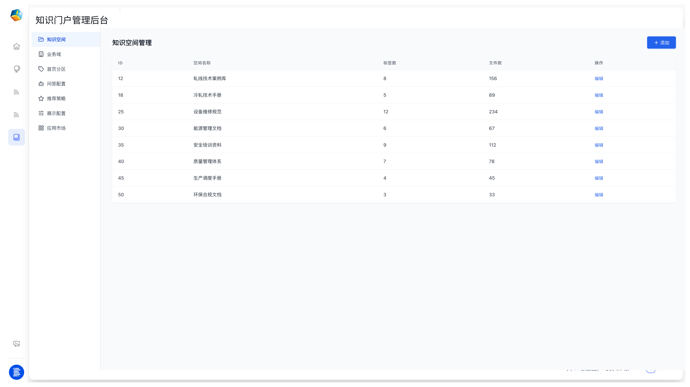
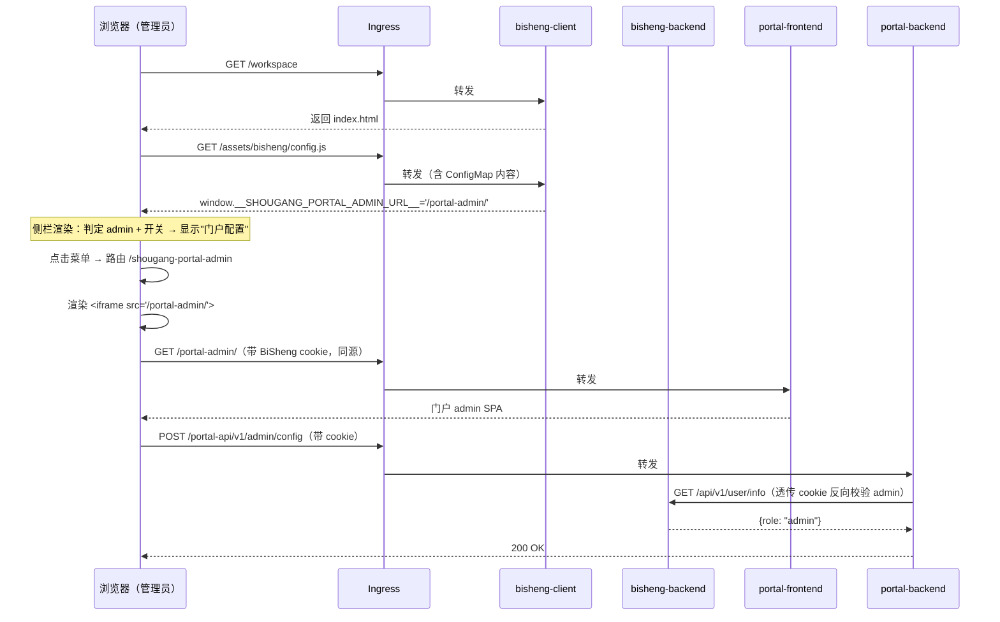

# BiSheng 工作台集成门户管理入口 —— 技术方案

> **结论先行**：在 BiSheng 打 7 处最小源码补丁（前端 6 + 后端 1）、复用 BiSheng 现有"系统配置 YAML"作为客户自助开关（ConfigMap 作为部署默认值兜底）、Ingress 把门户和 BiSheng 收拢到同源，即可让 BiSheng 工作台侧栏出现一个"门户配置"菜单，点击在 iframe 内打开知识门户的后台管理界面。改动总量约 40 行代码 + 几份 K8s YAML，对 BiSheng 上游零分叉、对非首钢部署零影响。
>
> **当前进度**：开发期跨域 demo 走 §7 P0 路径——利用 BiSheng test 环境（120:3002，release CI + `bisheng-deploy test`）+ 现有门户部署（114:3001）拼出最小验证链路，零额外部署。生产同源化（P2-P5）保留为后续阶段。

---

## 1. 需求

### 1.1 业务诉求

首钢客户提出：管理员希望在 BiSheng 工作台（截图位置）的左侧栏直接打开门户后台管理界面，不必在两个浏览器标签页间切换。



具体要求：

- **位置**：BiSheng client 工作台 `/workspace` 左侧固定侧栏，"知识空间"图标下方
- **可见性**：仅 BiSheng 管理员可见；普通员工无入口
- **部署隔离**：仅首钢部署的 BiSheng 出现该入口；BiSheng 在其他客户处部署不能看到首钢专属菜单
- **目标页面**：知识门户的 admin 页面
  - **开发期**：已部署在 `http://192.168.106.114:3001/admin`，复用即可，门户侧零改动
  - **生产期**：与 BiSheng 同 host 同源 `/portal-admin/`

### 1.2 项目约束

| 约束 | 含义 |
|---|---|
| BiSheng 是开源上游 | 任何源码分叉都增加长期维护成本，改动必须可重新应用、可与上游升级共存 |
| 门户层不持有业务数据 | 门户与 BiSheng 的职责边界继续维持，不借此机会让门户接管用户/权限/审计 |
| 生产为 K8s 部署 | 方案必须能落到标准 K8s 工件（Deployment / ConfigMap / Ingress）|
| 不引入额外组件 | 不引入 SSO 网关、API Gateway、新的鉴权中心 |

### 1.3 范围

| 在范围内 | 不在范围内 |
|---|---|
| BiSheng client 侧栏新增菜单项 | 修改 BiSheng 后端接口或数据库 |
| iframe 嵌入门户 admin 页面 | 门户接管 BiSheng 用户管理 |
| ConfigMap 驱动的部署开关 | BiSheng 多租户 / 多空间能力扩展 |
| 同源 cookie 复用 + BFF 反向鉴权 | 门户业务功能扩展 |

---

## 2. 设计原则

**三条原则共同保证"动得最少，活得最久"**。后续所有技术决策都由这三条推导出来。

| 原则 | 含义 | 推论 |
|---|---|---|
| **同源优先** | 浏览器侧所有 HTTP 流量都进同一个 ingress、同一个 host | 免去 X-Frame-Options / CORS / Cookie SameSite 三大坑；iframe 直接拿父页面 cookie |
| **配置即开关** | 用 BiSheng 现成的 `/assets/bisheng/config.js` 注入机制承载首钢专属开关 | 不在 BiSheng schema/DB 加字段；运维改 ConfigMap 即可开关菜单 |
| **补丁可重应用** | 所有 BiSheng 源码改动以 git patch 形式管理，CI Dockerfile 通过 `git apply` 注入 | 上游升级时 patch 复用率 ≥ 90%；patch 失败时人工 rebase 仍可控 |

---

## 3. 整体架构

> **两阶段拓扑差异**：本章 §3.1–3.3 描述生产期同源最终态。开发期由于 BiSheng test 环境（192.168.106.120:3002）与门户已部署实例（192.168.106.114:3001）跨主机，链路降级为跨域 iframe，鉴权层暂时弱化——开发期落地步骤见 §7 P0。
>
> | 阶段 | BiSheng 入口 | 门户入口 | iframe URL | cookie 透传 | BFF 鉴权 |
> |---|---|---|---|---|---|
> | **开发期**（当前）| `192.168.106.120:3002` | `192.168.106.114:3001/admin` | 绝对 URL | ❌ 跨域不带 | 跳过（门户 admin 当前依赖网络隔离）|
> | **生产期** | `bisheng.shougang.local/workspace` | `bisheng.shougang.local/portal-admin/` | 同源相对路径 `/portal-admin/` | ✅ 自动 | 启用 §6.2 中间件 |

### 3.1 拓扑（生产期同源）

```
                     ┌─── shougang-bisheng ingress ────────────────────┐
                     │                                                 │
浏览器 ─────────────►│  /workspace/*       → bisheng-client svc        │
                     │  /api/v1/*          → bisheng-backend svc       │
                     │  /assets/bisheng/*  → bisheng-client svc        │
                     │                       (含 ConfigMap 注入的      │
                     │                        config.js)               │
                     │  /portal-admin/*    → portal-frontend svc  ★新增 │
                     │  /portal-api/*      → portal-backend svc   ★新增 │
                     └─────────────────────────────────────────────────┘
                                         │
                            (所有流量同 host，浏览器视角同源)
```

### 3.2 关键交互序列



### 3.3 关键设计点

- **iframe 同源**：父页面与 iframe 在同一 host，浏览器自动带 cookie，不需要任何跨域配置（已验证 BiSheng cookie `path` 默认 `/`，覆盖 `/portal-api/*`）
- **双源开关**：URL 既是开关（有/无）又是值（iframe src），二合一；同时支持两个来源——
  - **运营开关**（首选）：BiSheng "系统-系统配置" YAML 里的 `shougang.portal_admin_url` 字段（结构化命名空间），admin 在 BiSheng UI 内自助维护
  - **部署默认值**（兜底）：ConfigMap 注入的 `window.__SHOUGANG_PORTAL_ADMIN_URL__`，本地开发和"YAML 字段未配置时的安全默认"
  - 优先级：YAML 优先，window 兜底（`bsConfig?.shougang?.portal_admin_url ?? window.__SHOUGANG_PORTAL_ADMIN_URL__`）
  - **YAML 结构化的额外好处**：`shougang:` 命名空间还容纳 `deployment_label` 等纯标识字段，提升 admin 阅读 YAML 时的可识别度，且 BiSheng `parse_key` 对整个 block 文本保留更稳定（参考 §附录 B 决策行）
- **菜单可见性 = BFF 鉴权**：两端**必须**用同一权限条件（`role === 'admin'`），否则会出现"菜单可见但点进去 403"的体验割裂
- **门户 BFF 不自己管用户**：通过反向调 BiSheng `/api/v1/user/info` 校验当前 cookie 对应的角色，结果就地丢弃，不持久化

---

## 4. 代码层方案：BiSheng 7 处最小补丁

**总改动 ≈ 40 行代码，集中在 BiSheng client 前端，外加后端 1 处把 YAML 字段透传到前端**。

### 4.1 改动总览

| # | 文件 | 改动 | 行数 |
|---|---|---|---|
| 1 | `src/frontend/client/src/layouts/MainLayout.tsx` | 双源开关读取 + admin 判断 + 移动端排除 + links 追加一项 | +12 |
| 2 | `src/frontend/client/src/routes/index.tsx` | 加 lazy import + 路由表追加一条 | +2 |
| 3 | `src/frontend/client/src/pages/ShougangPortalAdmin/index.tsx` | 新文件：从双源读 URL 后渲染铺满工作区的 iframe | +12 |
| 4 | `src/frontend/client/src/locales/zh-Hans/translation.json` | 加 `com_nav_portal_admin` 翻译键 | +1 |
| 5 | `src/frontend/client/src/vite-env.d.ts` | 给 `window.__SHOUGANG_PORTAL_ADMIN_URL__` 加 TS 类型 | +5 |
| 6 | `src/frontend/client/src/types/chat/config.ts` | `BsConfig` 类型加 `shougang?: { portal_admin_url?: string; deployment_label?: string }` | +3 |
| 7 | `src/backend/bisheng/workstation/api/endpoints/config.py` | `get_config` 函数透传 YAML `shougang` 命名空间到响应 | +2 |

### 4.2 各文件改动明细

#### 文件 1：MainLayout.tsx

**位置**：在 `Sidebar` 组件第 104 行附近、`links` 数组定义之前。

```tsx
// 首钢门户专属入口：仅首钢部署 + 系统超管 + 桌面端才显示
const portalAdminUrl =
  bsConfig?.shougang?.portal_admin_url          // 优先：BiSheng 系统配置 YAML 的 shougang 命名空间
  ?? window.__SHOUGANG_PORTAL_ADMIN_URL__;      // 兜底：ConfigMap 注入的部署默认值
const isSuperAdmin = user?.role === 'admin';
const showPortalAdminTab = isSuperAdmin && !isMobile && Boolean(portalAdminUrl);
```

`links` 数组（原第 107–142 行）末尾追加：

```tsx
{
  section: 'portal-admin',
  to: '/shougang-portal-admin',
  icon: <MonitorIcon />,                    // 复用现有图标，不引新依赖
  label: localize('com_nav_portal_admin'),
  isActive: pathname.startsWith('/shougang-portal-admin'),
},
```

`.filter()` 内追加：

```tsx
if (l.section === 'portal-admin') return showPortalAdminTab;
```

**三个判断条件各自的理由**：

- **`role === 'admin'`（不用 plugins）**：必须和 §6 BFF 鉴权中间件用同一条件，否则部门管理员能看到菜单但点进去 403。BiSheng 现有 `plugins.includes('admin'|'backend')` 颗粒度不一致——保守用 role 系统超管。注意 BiSheng 实际值是小写 `'admin'`（不是 `SystemRoles` 枚举里的 `'ADMIN'`），勘察后确认与现有代码 `MainLayout.tsx:135` 一致。
- **`!isMobile`**：移动端 iframe 嵌入桌面 admin 页面体验差（缩放、滚动、键盘遮挡），直接不展示。
- **`Boolean(portalAdminUrl)`**：双源任一有值即视为"开关打开"。

#### 文件 2：routes/index.tsx

**顶部加 lazy import**：

```tsx
const ShougangPortalAdmin = lazy(() => import('@/pages/ShougangPortalAdmin'));
```

**`MainLayout` 的 `children` 数组里追加**：

```tsx
{ path: 'shougang-portal-admin', element: <ShougangPortalAdmin /> },
```

#### 文件 3：pages/ShougangPortalAdmin/index.tsx（新建）

```tsx
import { useGetBsConfig } from '~/hooks/queries/data-provider';

export default function ShougangPortalAdmin() {
  const { data: bsConfig } = useGetBsConfig();
  const url =
    bsConfig?.shougang?.portal_admin_url
    ?? window.__SHOUGANG_PORTAL_ADMIN_URL__;
  if (!url) return null;
  return (
    <div className="h-full w-full bg-white">
      <iframe
        src={url}
        title="门户配置"
        className="h-full w-full border-0"
      />
    </div>
  );
}
```

**为什么直接 `null` 而不是错误页**：理论上路由匹配到这里时开关一定为 true（侧栏不会显示菜单否则）；走到这里说明用户手动改地址栏，简单回 null 即可，无需再加错误处理。

#### 文件 6：types/chat/config.ts

在 `BsConfig` type 第 547 行附近追加：

```ts
shougang?: {
  portal_admin_url?: string;
  deployment_label?: string;
};
```

#### 文件 7：backend/bisheng/workstation/api/endpoints/config.py

在 `get_config` 函数第 30 行后追加（与 `linsight_invitation_code`、`waiting_list_url` 同模式，但透传整个 `shougang` 命名空间）：

```python
shougang_conf = (await bisheng_settings.aget_all_config()).get('shougang', None)
ret['shougang'] = shougang_conf if isinstance(shougang_conf, dict) else None
```

**为什么透传整个 `shougang` 子结构而不是单字段**：YAML 用了结构化命名空间，后端这里也按 namespace 整体透传，前端按 `bsConfig.shougang.xxx` 读，结构一致。未来 `shougang:` 下加新字段时**后端不用再改**——这是结构化命名空间相对扁平字段的最大维护收益。

**这一行为何放在 BiSheng 后端而不是用 nginx 反代改写**：BiSheng 前端 `useGetBsConfig()` 是 react-query 缓存的强类型接口，所有客户端配置都从这里读，统一管道；如果走 nginx 注入会破坏类型契约且难以维护。

#### 文件 4：locales/zh-Hans/translation.json

```json
"com_nav_portal_admin": "门户配置"
```

英/日语言文件不动；i18next 缺 key 时回退到 key 本身，对中文部署无影响。

#### 文件 5：vite-env.d.ts

```ts
declare global {
  interface Window {
    __SHOUGANG_PORTAL_ADMIN_URL__?: string;
  }
}
export {};
```

### 4.3 门户侧适配（同 PR 内一并改）

为支持同源部署在 `/portal-admin/` 子路径下，门户前端做两处适配：

**`frontend/vite.config.ts`**：

```ts
export default defineConfig({
  base: process.env.VITE_BASE_PATH || '/',
  // ...原有配置
});
```

**`frontend/src/api/` 内统一从环境变量读 API base**：

```ts
const API_BASE = import.meta.env.VITE_API_BASE || '/api/v1';
```

构建命令（CI 中由部署环境变量驱动）：

```bash
VITE_BASE_PATH=/portal-admin/ \
VITE_API_BASE=/portal-api/v1 \
npm run build
```

**门户 BFF 加 `root_path`**：

```python
# backend/app/main.py
app = FastAPI(root_path=os.getenv("PORTAL_ROOT_PATH", ""))
```

生产环境设 `PORTAL_ROOT_PATH=/portal-api`，本地开发不设，BFF 自动适配前缀。

---

## 5. 部署层方案：K8s 工件

**五份 YAML + 一个 Dockerfile** 即可承载本方案在 K8s 上的全部部署面。Dockerfile 同时构建 BiSheng 前端与后端镜像（patch 涉及两侧）。

### 5.1 自定义 BiSheng 前端镜像（Dockerfile + git apply）

```dockerfile
# deploy/Dockerfile.bisheng-frontend
FROM dataelement/bisheng-frontend:0.5.x AS upstream
FROM node:20 AS builder
COPY --from=upstream /src /src
COPY bisheng-patches/frontend/*.patch /tmp/patches/
RUN cd /src && \
    git init && git add -A && git commit -m "vendored" -q && \
    git apply /tmp/patches/*.patch && \
    cd frontend/client && npm ci && npm run build
FROM nginx:alpine
COPY --from=builder /src/frontend/client/dist /usr/share/nginx/html
COPY deploy/nginx-bisheng.conf /etc/nginx/nginx.conf
```

### 5.2 自定义 BiSheng 后端镜像（同款 git apply）

```dockerfile
# deploy/Dockerfile.bisheng-backend
FROM dataelement/bisheng-backend:0.5.x
COPY bisheng-patches/backend/*.patch /tmp/patches/
RUN cd /opt/bisheng && \
    git init && git add -A && git commit -m "vendored" -q && \
    git apply /tmp/patches/*.patch
```

**关键点**：

- patch 文件用 `git format-patch` 产出，保留作者、commit message、上下文
- `git apply` 失败时整个 build 失败——CI 失败立即可见
- 前端、后端 patch 分目录管理（`bisheng-patches/frontend/` 与 `bisheng-patches/backend/`），各自独立演进
- 镜像 tag：`registry.shougang.local/bisheng-shougang-{frontend|backend}:<bisheng-version>-<patch-version>`，例如 `0.5.3-shougang.1`

### 5.3 ConfigMap：部署默认开关（兜底）

> **运营开关首选 BiSheng "系统配置" YAML**——admin 在 BiSheng 后台 UI 里加一段 `shougang:` 命名空间即可启用：
>
> ```yaml
> # 首钢集团知识门户专属配置
> shougang:
>   deployment_label: "首钢集团知识门户"      # 部署标识，仅供 admin 阅读 YAML 时识别
>   portal_admin_url: "/portal-admin/"      # iframe 嵌入的门户 admin URL；空则不显示菜单
> ```
>
> 本节 ConfigMap 仅作为"客户管理员尚未配置时的部署默认值"，且方便本地开发与紧急回退。注意 ConfigMap 里 window 变量保持扁平（仅承载 URL 这个开关本身），不必复制 `deployment_label` 这种纯标识字段——后者只服务于 YAML 阅读体验。

```yaml
# deploy/bisheng-shougang-config.yaml
apiVersion: v1
kind: ConfigMap
metadata:
  name: bisheng-shougang-frontend-config
  namespace: shougang-knowledge
data:
  config.js: |
    // 品牌定制
    window.BRAND_CONFIG = {
      brandName: { zh: "首钢知识门户", en: "Shougang Portal" },
    };
    // 首钢专属：开启侧栏"门户配置"入口
    window.__SHOUGANG_PORTAL_ADMIN_URL__ = '/portal-admin/';
```

挂载到 bisheng-client Deployment：

```yaml
# deploy/bisheng-client-deployment.yaml （增量片段）
spec:
  template:
    spec:
      containers:
      - name: bisheng-client
        image: registry.shougang.local/bisheng-shougang:0.5.3-shougang.1
        volumeMounts:
        - name: shougang-config
          mountPath: /usr/share/nginx/html/assets/bisheng/config.js
          subPath: config.js
      volumes:
      - name: shougang-config
        configMap:
          name: bisheng-shougang-frontend-config
```

**运维体验**：
- **常态**：客户 admin 在 BiSheng "系统-系统配置" 页面修改 YAML，刷新即生效，无需运维介入
- **关闭门户入口（紧急）**：admin 删 YAML 字段 → 同时 `kubectl edit configmap` 删 window 变量 → `kubectl rollout restart deployment/bisheng-client`
- **非首钢部署**：不创建这个 ConfigMap、不在 YAML 加字段，菜单永远不显示

### 5.4 Ingress：同域路径聚合

```yaml
# deploy/ingress.yaml
apiVersion: networking.k8s.io/v1
kind: Ingress
metadata:
  name: shougang-bisheng
  annotations:
    nginx.ingress.kubernetes.io/use-regex: "true"
    nginx.ingress.kubernetes.io/rewrite-target: /$2
spec:
  rules:
  - host: bisheng.shougang.local
    http:
      paths:
      # BiSheng 原有路由
      - path: /workspace(/|$)(.*)
        pathType: ImplementationSpecific
        backend:
          service: { name: bisheng-client, port: { number: 80 } }
      - path: /api/v1(/|$)(.*)
        pathType: ImplementationSpecific
        backend:
          service: { name: bisheng-backend, port: { number: 7860 } }
      - path: /assets/bisheng(/|$)(.*)
        pathType: ImplementationSpecific
        backend:
          service: { name: bisheng-client, port: { number: 80 } }
      # 门户新增（重写后端路径以匹配各自服务的内部前缀）
      - path: /portal-admin(/|$)(.*)
        pathType: ImplementationSpecific
        backend:
          service: { name: portal-frontend, port: { number: 80 } }
      - path: /portal-api(/|$)(.*)
        pathType: ImplementationSpecific
        backend:
          service: { name: portal-backend, port: { number: 8010 } }
```

### 5.5 门户 Deployment 与 nginx 头要求

门户前端、后端各一份标准 Deployment + Service。**前端 nginx 必须满足以下两条 header 要求**，否则 iframe 嵌入会被浏览器拒绝：

```nginx
# portal-frontend nginx.conf 关键配置
server {
    # ...

    # 必须：允许同源嵌入。默认很多 nginx 模板会加 X-Frame-Options DENY，本方案下必须删掉或改为 SAMEORIGIN
    add_header X-Frame-Options "SAMEORIGIN" always;

    # 必须：CSP frame-ancestors 不能限制为 'none'；'self' 即可
    add_header Content-Security-Policy "frame-ancestors 'self' bisheng.shougang.local" always;

    # 推荐：禁止外网直接访问门户 admin（仅允许通过 BiSheng ingress 路径进入）
    # 由 ingress 层做 IP 白名单或基础认证更合适，nginx 这里不做硬限制
}
```

构建命令带上 §4.3 的环境变量：

```bash
docker build \
  --build-arg VITE_BASE_PATH=/portal-admin/ \
  --build-arg VITE_API_BASE=/portal-api/v1 \
  -t registry.shougang.local/portal-frontend:<ver> \
  ./frontend
```

---

## 6. 认证与权限

**结论：生产同源拓扑下 iframe 天然继承 BiSheng cookie，门户 BFF 反向调 `/api/v1/user/info` 二次校验，不引入任何新的鉴权机制。开发期跨域拓扑下鉴权链路降级（cookie 不带），门户 admin 暂时依赖网络隔离 + 不公开 URL，等生产同源化后再启用本章 BFF 中间件。**

### 6.0 开发期降级说明

| 检查项 | 开发期跨域（114 ↔ 120）| 生产期同源 |
|---|---|---|
| iframe 加载是否成功 | ✅（已确认 114 nginx 无 X-Frame-Options / CSP 限制） | ✅ |
| BiSheng cookie 是否到达门户 BFF | ❌ 跨域 + SameSite=Lax | ✅ |
| 谁能进门户 admin | 任何能访问 192.168.106.114:3001 的人 | 仅 BiSheng 系统超管 |
| BFF `/admin/*` 路由是否要鉴权 | 暂不要（不实现 §6.2 中间件） | 必须，按 §6.2 实现 |
| 风险 | 门户 admin 当前对内网 114 段开放，可见性靠"不公开 URL" | 鉴权完整 |

> ⚠️ **进入生产前必须切换**：生产同源化后，§6.2 中间件必须启用；切换路径 = §7 P3 阶段。

### 6.1 同源 cookie 自动复用（生产期）

- 用户在 BiSheng 登录 → 浏览器存 `access_token_cookie`（domain = `bisheng.shougang.local`）
- 加载 `/portal-admin/` iframe → 浏览器自动带这个 cookie
- 门户前端调 `/portal-api/...` → cookie 自动跟过去
- **整条链路浏览器侧零配置**

### 6.2 BFF 反向校验中间件

```python
# backend/app/api/middleware/admin_auth.py
async def verify_bisheng_admin(request: Request) -> dict:
    token = request.cookies.get("access_token_cookie")
    if not token:
        raise HTTPException(401, "未登录")
    # 透传 cookie 调 BiSheng，校验当前用户角色
    user = await bisheng_client.get_json(
        "/api/v1/user/info",
        cookies={"access_token_cookie": token},
    )
    role = user.get("data", {}).get("role")
    if role != "admin":            # 必须与 §4.2 文件 1 的菜单可见性条件保持一致
        raise HTTPException(403, "需要管理员权限")
    return user["data"]
```

挂到 `/admin/*` 路由组：

```python
admin_router = APIRouter(
    prefix="/admin",
    dependencies=[Depends(verify_bisheng_admin)],
)
```

> ⚠️ **不变量**：菜单可见性条件（MainLayout.tsx）和 BFF 鉴权条件（admin_auth.py）必须用 **完全相同的角色判断逻辑**。任何一边放宽（如 BFF 接受部门管理员），另一边必须同步放宽——否则用户体验会出现"菜单可见但点进去 403"的割裂。

### 6.3 风险与边界

| 风险 | 应对 |
|---|---|
| BiSheng cookie 名变更（升级） | 在常量层抽 `BISHENG_AUTH_COOKIE_NAME = "access_token_cookie"`，升级时一行改动 |
| token 24h 过期 | 中间件返回 401，前端 admin 页面拦截后 `window.top.location.href = '/login'` 让 BiSheng 重新登录 |
| 跨标签页登出不同步 | iframe 内任何 401 → 引导回 BiSheng 登录页；不需要主动 broadcast |
| BFF 反向校验加 1 跳延迟 | 仅 admin 接口需要校验（写操作低频），可接受；如需优化用 60s LRU 缓存 user_info |
| BiSheng 系统配置 YAML 缓存导致 admin 改完不生效 | BiSheng 后端可能缓存 YAML（待 P4 阶段实测）；如有缓存，verbatim 在客户文档说明"修改后等待 X 秒/重启 pod"，或加 patch 主动 invalidate |
| BiSheng YAML 编辑器对未知字段做 schema 校验 | P4 验证；如被拒绝，用 `information_conf:` 子结构包装（参考 BiSheng 现有 `information_conf.base_url` 模式） |
| 后端 patch 升级冲突概率高于前端 | `config.py` 的 `get_config` 函数签名变化时手工 rebase；本 patch 仅 2 行，rebase 成本可控 |

---

## 7. 实施计划

**六阶段渐进验证，前阶段不通过下阶段不开始**。P0 是利用现有 BiSheng test 环境（120:3002）+ 现有门户部署（114:3001）拼出的"跨域最小 demo"，零额外部署，半天可跑通。

| 阶段 | 目标 | 验收 |
|---|---|---|
| **P0 共享环境跨域 demo** | BiSheng patch 推到 120:3002 + 114 门户 iframe 跨域加载，让客户/团队在 120:3002 看到菜单 + 点开 iframe | admin 在 BiSheng 系统配置加 `shougang:` 命名空间 → 120:3002 工作台出现"门户配置"菜单 → 点击 iframe 加载 114:3001/admin |
| **P1 本地代码** | 7 处补丁本地手工应用，本地启 BiSheng dev server，菜单 + iframe 能渲染 | 浏览器看到菜单；点击进入 iframe |
| **P2 门户适配** | 门户前端支持 `VITE_BASE_PATH`；BFF 加 `root_path`；本地用 nginx 反代试同源 | 浏览器在 nginx 端口看到完整链路，cookie 自动透传 |
| **P3 BFF 鉴权** | admin 中间件接入；非 admin 用户访问 `/portal-api/admin/*` 返回 403 | 单测 + 手工浏览器测试 |
| **P4 镜像 + 测试集群** | 前端、后端 Dockerfile 跑通；patch 自动应用；ConfigMap + YAML 双源都验证 | YAML 字段切换 + ConfigMap 切换都能控制菜单可见性 |
| **P5 生产上线** | 首钢生产 K8s 灰度部署；运维侧文档交付 | 首钢管理员实际使用 |

### 7.0 P0 详细步骤（共享环境跨域 demo）

**前置确认**（已完成）：
- [x] `curl -sI http://192.168.106.114:3001/admin` 无 `X-Frame-Options` / `frame-ancestors` 限制 → 跨域 iframe 不会被拒
- [x] BiSheng test 环境部署链路已掌握：120:3002 前端走 `bisheng-deploy test`，后端走 release CI → 116

**步骤**：

1. **应用 7 处 patch 到 BiSheng release 分支**
   - 前端 6 处（文件 1-6）：`src/frontend/client/` 下
   - 后端 1 处（文件 7）：`src/backend/bisheng/workstation/api/endpoints/config.py`
   - `git push` 到 release → Drone CI 触发 → 116 backend 自动重启
   - ⚠️ **影响 116:3001 release 验收环境**——push 前打招呼

2. **手动部署 release 分支前端到 120:3002**
   ```bash
   ssh root@192.168.106.120 bisheng-deploy test release
   ```
   - 复用上次部署的 ref？看 `cat /var/lib/bisheng-deploy/test.json` 决定要不要传具体 commit
   - 输出 rc=0 + 看到 `commit=` 行即成功

3. **在 BiSheng 系统配置加首钢命名空间**
   - 浏览器访问 `http://192.168.106.120:3002/sys`
   - admin 登录 → 系统配置 → 在 YAML 末尾加：
     ```yaml
     # 首钢集团知识门户专属配置
     shougang:
       deployment_label: "首钢集团知识门户（114 开发环境）"
       portal_admin_url: "http://192.168.106.114:3001/admin"
     ```
   - 保存
   - 等 Redis 缓存刷新（看 §6.3 风险表，可能需要 admin 端短等或重启）

4. **验证菜单**
   - 访问 `http://192.168.106.120:3002/workspace/`
   - admin 用户左侧栏看到"门户配置"菜单 → 点击 → URL 跳到 `/shougang-portal-admin` → iframe 加载 114:3001/admin

### 7.1 验收清单（按阶段）

**P0 验收（共享环境跨域）**

- [ ] BiSheng release 分支前端已通过 `bisheng-deploy test release` 部署到 120:3002，commit 与 GitHub 一致
- [ ] BiSheng release 分支后端 CI 已部署到 116，120:3002 通过 Gateway 看到新后端
- [ ] BiSheng "系统配置" YAML 已加 `shougang:` 命名空间，保存成功
- [ ] **保存后再次打开 YAML 编辑器**：`shougang:` 整 block 应原样保留（验证 `parse_key` 文本保留行为）
- [ ] admin 用户访问 `http://192.168.106.120:3002/workspace/` 看到"门户配置"菜单
- [ ] 部门管理员、普通员工访问看不到菜单
- [ ] 点击菜单 → iframe 内 114:3001/admin 主界面正常加载，无 console `Refused to display ... in a frame because ...` 报错
- [ ] iframe 内进行配置变更（如改业务域名称），门户主站能看到效果

**P5 验收（生产同源终态）**

_功能可见性_
- [ ] BiSheng 系统超管（`role === 'admin'`）进 `/workspace`，左侧栏看到"门户配置"菜单（图标 + 文字）
- [ ] BiSheng 部门管理员、普通员工进 `/workspace` 看不到"门户配置"菜单
- [ ] 移动端浏览器（窄视口）下，超管也看不到"门户配置"菜单
- [ ] 点击菜单 → URL 变为 `bisheng.shougang.local/shougang-portal-admin`
- [ ] iframe 加载门户 admin 主界面，无白屏、无 console 报错（特别是 `Refused to display ... in a frame because ...` / `frame-ancestors` 报错）

_双源开关_
- [ ] BiSheng admin 在系统配置 UI 加 `shougang.portal_admin_url: "/portal-admin/"` → 保存 → 刷新 BiSheng → 菜单显现
- [ ] **保存后再次打开 YAML 编辑器**：`shougang:` 整个 block（含 `deployment_label` 注释或字段）应原样保留——验证 `parse_key` 的整 block 文本保留行为
- [ ] 删除 YAML `shougang:` 节 + 不挂 ConfigMap → 菜单消失
- [ ] 仅挂 ConfigMap、不在 YAML 加字段 → 菜单显现（验证 fallback）
- [ ] YAML 与 ConfigMap 同时配不同 URL → iframe 加载 YAML 里的 URL（验证优先级）

_鉴权一致性_
- [ ] 部门管理员通过手动改 URL 强行进 `/shougang-portal-admin` → iframe 内门户 admin 调用 `/portal-api/admin/*` 一律 403
- [ ] BiSheng 注销后 → iframe 内任何 admin API 返回 401，前端正确引导重新登录

_集成稳定性_
- [ ] 在门户内做配置变更（增加业务域、改 system_prompt 等），刷新 BiSheng 主站对应展示能看到生效
- [ ] BiSheng 升级一个小版本（如 0.5.3 → 0.5.4），前端、后端 patch 都自动 apply 通过

---

## 8. 维护与演进

### 8.1 BiSheng 上游升级

1. 修改 `Dockerfile.bisheng-frontend` 与 `Dockerfile.bisheng-backend` 里的 `FROM dataelement/bisheng-{frontend|backend}:<新版本>`
2. CI 自动重 build → 90% 概率 patch 直接 apply 成功
3. apply 失败时：本地 checkout 上游新版本 → 手工 merge patch → `git format-patch` → 替换 `bisheng-patches/{frontend|backend}/`
4. 后端 patch 失败概率高于前端（Python 函数签名/导入路径变化频繁），重点 review `config.py` 的 `get_config` 函数
5. 测试集群验证 → 上线

### 8.2 patch 文件清单

```
shougang-knowledge-portal/
├── bisheng-patches/
│   ├── frontend/
│   │   └── 0001-add-shougang-portal-menu.patch   # 文件 1-6（前端 6 处改动）
│   └── backend/
│       └── 0001-expose-shougang-portal-url.patch # 文件 7（后端 1 处改动）
├── deploy/
│   ├── Dockerfile.bisheng-frontend
│   ├── Dockerfile.bisheng-backend
│   ├── bisheng-shougang-config.yaml              # ConfigMap（部署默认值）
│   ├── bisheng-client-deployment.yaml            # 含 ConfigMap 挂载
│   ├── ingress.yaml                              # 同域聚合
│   ├── portal-frontend-deployment.yaml           # 含 nginx X-Frame-Options 头
│   └── portal-backend-deployment.yaml
└── docs/
    └── bisheng-portal-admin-integration.md       # 本文档
```

### 8.3 未来增强（可选，不在本期范围）

| 方向 | 说明 |
|---|---|
| iframe loading 状态 | 加 skeleton，避免门户首屏白屏 |
| postMessage 桥 | iframe 内路由变化同步到外层地址栏，刷新不丢上下文 |
| BFF user_info 短缓存 | 减少 admin 接口的 1 跳延迟 |
| 审计日志 | 记录"哪个 BiSheng 用户改了什么门户配置" |

---

## 附录 A：关键文件路径索引

| 用途 | 绝对路径 |
|---|---|
| BiSheng client 侧栏组件 | `/Users/lilu/Projects/bisheng/src/frontend/client/src/layouts/MainLayout.tsx` |
| BiSheng client 路由表 | `/Users/lilu/Projects/bisheng/src/frontend/client/src/routes/index.tsx` |
| BiSheng client 中文翻译 | `/Users/lilu/Projects/bisheng/src/frontend/client/src/locales/zh-Hans/translation.json` |
| BiSheng client TS 类型声明 | `/Users/lilu/Projects/bisheng/src/frontend/client/src/vite-env.d.ts` |
| BiSheng index.html（config.js 加载点） | `/Users/lilu/Projects/bisheng/src/frontend/client/index.html` |
| 门户前端 vite 配置 | `/Users/lilu/Projects/shougang-group-knowledge-portal/frontend/vite.config.ts` |
| 门户 BFF 入口 | `/Users/lilu/Projects/shougang-group-knowledge-portal/backend/app/main.py` |

## 附录 B：关键决策记录

| 决策 | 选择 | 替代方案 | 不选的原因 |
|---|---|---|---|
| 嵌入方式 | BiSheng 内嵌 iframe | 新标签页 / 浏览器扩展 / 反代 HTML 注入 | 体验割裂 / 用户侧安装成本 / DOM 结构脆弱 |
| 开关位置 | **双源：BiSheng 系统配置 YAML 主 + ConfigMap 兜底** | 单 ConfigMap / 单 YAML / BiSheng DB 加 schema | YAML 单源缺紧急回退手段；ConfigMap 单源不利客户自助；DB schema = 真定制 |
| 双源优先级 | YAML 优先，window 兜底 | window 优先 | YAML 是运营开关、客户主动维护；window 是部署默认值，运营改 YAML 时不应被覆盖 |
| YAML 字段结构 | **结构化命名空间** `shougang: { portal_admin_url, deployment_label }` | 扁平字段 `shougang_portal_admin_url` / 顶部注释标识 | 命名空间下未来扩展首钢专属字段不需改后端；BiSheng `parse_key` 对整个 block 保留更稳定（含注释）；扁平字段命名散乱、注释方案受 `parse_key` 行为限制 |
| URL 传递 | YAML/ConfigMap 都写同源相对路径 `/portal-admin/` | 跨域绝对 URL | 跨域要处理 X-Frame-Options + Cookie SameSite + CORS 三件套 |
| 权限判断 | `role === 'admin'`（系统超管，BiSheng 实际用小写） | `plugins.includes('admin'\|'backend')` / `role === 'ADMIN'`（枚举大写） | 必须与 BFF 鉴权条件完全一致；plugins 颗粒度松，会让部门管理员看到菜单但点进去 403；BiSheng 后端返回 `user.role` 是小写 `'admin'`，与 `SystemRoles.ADMIN` 枚举的大写不一致 |
| 移动端 | 显式 `!isMobile` 排除 | 不区分 | iframe 内桌面 admin 在窄屏体验差，宁可不显示 |
| 鉴权实现 | BFF 反向调 BiSheng `/api/v1/user/info` | 自建用户表 / JWT 解析 | 门户不持有业务数据原则；自解析 JWT 易和 BiSheng 升级脱钩 |
| 补丁交付 | git patch + Dockerfile apply | 维护 BiSheng fork 仓库 | fork 长期分歧成本高；patch 文件可读、可 review、可独立版本化 |
| 前端 nginx 头 | `X-Frame-Options: SAMEORIGIN` + `frame-ancestors 'self'` | 默认（DENY）| 默认会拒绝同源 iframe 嵌入 |
