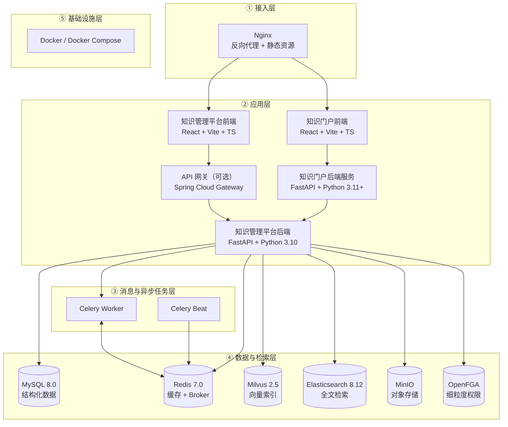

# 首钢股份知识门户软件技术架构

# 1. 总体技术栈分层

### 1.1 分层全景图



### 1.2 各层职责一览

| 层 | 职责 | 关键软件 |
|---|---|---|
| ① 接入层 | 流量入口、静态资源托管、反向代理、TLS 卸载 | Nginx |
| ② 应用层 | 业务逻辑、API 服务、前端交互 | FastAPI、React、Vite、Spring Cloud Gateway |
| ③ 消息与异步任务层 | 异步任务执行、定时调度、解耦 | Celery + Redis Broker、Celery Beat |
| ④ 数据与检索层 | 数据持久化、向量与全文检索、对象存储、权限关系 | MySQL、Redis、Milvus、Elasticsearch、MinIO、OpenFGA |
| ⑤ 基础设施层 | 容器编排、部署 | Docker、Docker Compose |

---

## 2. 应用层

**核心结论**：应用层由"前端、后端服务、API 网关"三类组件构成，统一使用业内主流框架，前端与后端通过 REST/SSE 解耦，可独立发布。

### 2.1 前端

| 应用 | 框架 | 状态管理 | 构建工具 | 备注 |
|---|---|---|---|---|
| 知识门户前端 | React + TypeScript | React Hooks（轻量） | Vite | 单页应用，构建产物为静态资源 |
| 知识管理平台 - 管理控制台 | React + TypeScript | Zustand | Vite | 后台管理界面、流程编辑器 |
| 知识管理平台 - 用户工作台 | React + TypeScript | Recoil | Vite | 用户对话、知识检索 |

公共依赖：

- **UI 组件库**：Radix UI（无障碍组件，shadcn/ui 风格）
- **样式**：TailwindCSS 3
- **图标**：lucide-react
- **国际化**：react-i18next（中 / 英 / 日）
- **流程画布**：@xyflow/react（仅平台管理控制台使用）
- **HTTP 客户端**：axios（在各项目内统一封装）

### 2.2 后端服务

#### 2.2.1 知识门户后端服务

| 项 | 选型 | 说明 |
|---|---|---|
| 语言 | Python 3.11+ | 已在 3.13 验证 |
| Web 框架 | FastAPI | 异步 ASGI |
| ASGI 服务器 | Uvicorn | 单进程 + reload（开发） |
| HTTP 客户端 | httpx | 同步 / 异步双模式 |
| 数据校验 | Pydantic v2 + pydantic-settings | 配置与请求模型校验 |
| 配置持久化 | 本地 JSON 文件 | 原子写，加 threading.Lock |
| 依赖管理 | pip + venv | 单文件 pyproject.toml |

**职责**：业务聚合（多接口合并）、配置管理（门户运营内容）、接口代理（流式问答透传）。**不引入数据库与缓存**，保持轻量。

#### 2.2.2 知识管理平台后端

| 项 | 选型 | 说明 |
|---|---|---|
| 语言 | Python 3.10 | 严格固定，不向上兼容 |
| Web 框架 | FastAPI | 多 worker（默认 8） |
| ASGI 服务器 | Uvicorn | 生产配置 |
| ORM | SQLModel + SQLAlchemy | 同步 / 异步双模式，连接池 100 |
| 数据校验 | Pydantic v2 | |
| 工作流引擎 | LangGraph 0.3 | DAG 执行、回调流式输出 |
| LLM 编排 | LangChain 0.3 | 链式调用、Agent 框架 |
| 异步任务 | Celery 5.x | 见消息层 |
| 日志 | Loguru | 结构化日志 + 文件轮转 |
| 密码学 | cryptography（Fernet） | 配置文件密码加密 |
| 依赖管理 | uv | 已从 Poetry 迁移，锁文件 uv.lock |

### 2.3 API 网关（可选）

| 项 | 选型 |
|---|---|
| 语言 | Java 17（OpenJDK） |
| 框架 | Spring Cloud Gateway |
| 构建 | Maven 3.6+ |
| 监听端口 | 8180 |

**职责**：单点登录（OAuth2 / OIDC）、敏感词过滤、限流、租户路由、License 校验。

**何时启用**：当需要 SSO、企业级限流、商业 License 校验时启用；轻量场景前端可直连后端，跳过网关。

---

## 3. 数据与检索层

### 3.1 关系数据库 — MySQL 8.0

- **角色**：结构化业务数据持久化
- **承载内容**：用户、角色、租户、知识库元数据、文件元数据、流程定义、会话与消息、审计日志、评测、标注等约 44 张表
- **接入方式**：SQLModel ORM + 连接池（pool_size=100）
- **多租户隔离**：通过 `tenant_id` 列在 ORM 事件钩子中自动追加 WHERE 过滤

### 3.2 缓存与 Broker — Redis 7.0

按 DB 编号划分，承担三类用途：

| DB | 用途 | 内容 |
|---|---|---|
| db0 | 业务缓存 | 配置缓存（TTL 100s）、会话、热点数据 |
| db1 | 智能体状态 | 智能体运行时状态 |
| db2 | 任务队列 Broker | Celery 任务消息 |

- **多租户隔离**：以 `t:{tenant_id}:key` 前缀划分

### 3.3 向量数据库 — Milvus 2.5

- **角色**：知识库 RAG 的向量检索
- **承载内容**：文档分块的 embedding 向量
- **架构依赖**：etcd（元数据）+ MinIO（向量数据落盘）+ Milvus 主体
- **多租户隔离**：按租户拆分集合或分区

### 3.4 全文检索 — Elasticsearch 8.12

部署两套独立实例：

| 实例 | 用途 | 备注 |
|---|---|---|
| 业务检索实例 | 文档全文检索 | 与向量检索互补，构成"混合召回" |
| 分析实例 | 遥测数据与用户行为日志 | 与业务检索物理隔离，避免相互影响 |

### 3.5 对象存储 — MinIO（S3 兼容）

- **角色**：文件、图像、模型产物等大对象存储
- **协议**：S3 API 兼容，未来可平移至云端 S3 / OSS / COS
- **bucket 划分**：业务 bucket + 临时 bucket
- **多租户隔离**：按 `tenant_{code}/` 路径前缀

### 3.6 细粒度权限 — OpenFGA

- **角色**：资源级权限关系存储与判定
- **理论基础**：Google Zanzibar 论文实现
- **承载内容**：用户—资源—动作 的关系三元组
- **集成方式**：后端通过 SDK 查询，承担"是否允许 X 用户对 Y 资源做 Z 操作"的判定
- **与 RBAC 的关系**：RBAC 提供粗粒度的角色/菜单授权，OpenFGA 提供细粒度的资源级授权，两者互补

---

## 4. 消息与异步任务层

**核心结论**：所有耗时任务通过 **Celery + Redis Broker** 异步执行，按业务特性拆分为多条独立队列，避免相互拖累。

### 4.1 队列拆分

| 队列 | 并发模型 | 并发数 | 承载任务 |
|---|---|---|---|
| `knowledge_celery` | threads | 20 | 知识库文档处理：解析、分块、向量化 |
| `workflow_celery` | threads | 100 | 工作流执行：节点调度、回调 |
| `celery`（默认） | threads | 100 | 遥测、情报同步等通用任务 |
| 智能体专用 | 进程 + 协程 | 4 worker × 5 协程 | 智能体自主任务执行 |

### 4.2 定时任务

通过 **Celery Beat** 调度，包含 5 个内置定时任务（每日 00:30 / 05:30 触发遥测上报与情报同步）。

---

## 5. 容器化与部署

**核心结论**：所有组件均以 Docker 容器交付，通过 Docker Compose 编排；生产环境可平移至 Kubernetes。

### 5.1 容器编排

- **基础**：Docker 24+ 与 Docker Compose v2
- **主编排文件**：`docker-compose.yml`，包含 9 个核心服务
- **可选编排**：
  - 模型微调服务（GPU 节点）
  - 非结构化文档解析服务
  - 在线文档预览服务（OnlyOffice Document Server）

### 5.2 容器清单（核心）

| 容器角色 | 镜像基础 | 主要端口 | 备注 |
|---|---|---|---|
| 知识管理平台 - 后端 API | 内部业务镜像 | 7860 | FastAPI 在线服务 |
| 知识管理平台 - 后端 Worker | 内部业务镜像 | — | Celery 全部 worker + beat |
| 知识管理平台 - 前端 | 内部业务镜像 | 3001 | nginx 静态托管 |
| MySQL | mysql:8.0 | 3306 | 关系数据库 |
| Redis | redis:7.0.4 | 6379 | 缓存 + Broker |
| Milvus 主体 | milvusdb/milvus:v2.5.10 | 19530, 9091 | 向量库 |
| Milvus etcd | quay.io/coreos/etcd:v3.5.5 | — | Milvus 元数据 |
| Milvus / 业务 MinIO | minio/minio | 9000 | 文件 + Milvus 后端 |
| Elasticsearch | bitnami/elasticsearch:8.12 | 9200, 9300 | 全文检索 |
| OpenFGA | openfga/openfga | 8080, 3000 | 权限服务 |

知识门户的前后端目前以独立进程或独立容器部署在接入层之后，不在上述编排清单中。

### 5.3 环境分层

| 环境 | 部署形态 | 用途 |
|---|---|---|
| 开发环境 | 本机源码裸跑 + 联调环境数据 | 单人快速迭代 |
| 联调环境 | Docker Compose 全套部署 + CI 自动化 | 团队联调与回归 |
| 生产环境（规划） | Docker Compose / K8s 编排 + Nginx + 域名 + 监控接入 | 正式发布 |

### 5.4 配置体系

整套系统采用四层配置覆盖（高优先级覆盖低优先级）：

```
1. 配置文件（config.yaml，支持 !env ${VAR} 注入）
        ↓ 被覆盖
2. 环境变量（容器 ENV）
        ↓ 合并
3. 数据库内动态配置（管理后台修改）
        ↓ 缓存
4. Redis 缓存（TTL 100s）
```

部分配置支持运行期通过管理后台热修改，无须重启服务。

### 5.5 监控与可观测性

| 维度 | 当前方案 | 后续规划 |
|---|---|---|
| 日志 | Loguru 结构化日志 + 文件轮转 | 接入集中日志平台 |
| 链路追踪 | HTTP 中间件 TraceID 注入 | 接入 OpenTelemetry |
| 健康检查 | 各服务暴露 `/health` 端点 | 接入接入层探活 |
| 指标 | 暂无 | Prometheus + Grafana |
| 告警 | 暂无 | 对接首钢统一监控平台 |

---

## 6. 软件清单总览

按层级整理的全量软件清单，便于运维与采购：

| 层 | 组件 | 版本 | 默认端口 | 部署形态 | 角色 |
|---|---|---|---|---|---|
| ① 接入 | Nginx | 1.x | 80 / 443 | 容器 / 宿主机 | 反向代理 + 静态资源 |
| ② 应用-前端 | React | 18 / 19 | — | 静态构建产物 | UI 框架 |
| ② 应用-前端 | Vite | 5 / 6 | — | 构建工具 | 打包 |
| ② 应用-前端 | TypeScript | 5.x | — | 开发期 | 静态类型 |
| ② 应用-前端 | TailwindCSS | 3 | — | 开发期 | 原子样式 |
| ② 应用-前端 | Radix UI | — | — | 运行期 | UI 组件库 |
| ② 应用-前端 | react-i18next | — | — | 运行期 | 国际化 |
| ② 应用-前端 | @xyflow/react | — | — | 运行期 | 流程画布 |
| ② 应用-后端 | Python | 3.10 / 3.11+ | — | 解释器 | 运行时 |
| ② 应用-后端 | FastAPI | 0.115+ | 7860 / 8010 | 容器 / 进程 | Web 框架 |
| ② 应用-后端 | Uvicorn | 0.30+ | — | ASGI | HTTP 服务器 |
| ② 应用-后端 | SQLModel + SQLAlchemy | latest | — | 库 | ORM |
| ② 应用-后端 | Pydantic | v2 | — | 库 | 校验 |
| ② 应用-后端 | LangGraph | 0.3 | — | 库 | 工作流引擎 |
| ② 应用-后端 | LangChain | 0.3 | — | 库 | LLM 编排 |
| ② 应用-后端 | Loguru | latest | — | 库 | 日志 |
| ② 应用-后端 | uv | 2.4+ | — | 依赖管理 | 包管理 |
| ② 应用-网关 | OpenJDK | 17 | — | JVM | 运行时 |
| ② 应用-网关 | Spring Cloud Gateway | 4.x | 8180 | 容器 | API 网关 |
| ② 应用-网关 | Maven | 3.6+ | — | 构建工具 | 打包 |
| ③ 消息 | Celery | 5.x | — | 容器 | 异步任务执行 |
| ③ 消息 | Celery Beat | 5.x | — | 容器 | 定时任务 |
| ④ 数据 | MySQL | 8.0 | 3306 | 容器 | 关系数据库 |
| ④ 数据 | Redis | 7.0.4 | 6379 | 容器 | 缓存 + Broker |
| ④ 数据 | Milvus | 2.5.10 | 19530, 9091 | 容器 | 向量数据库 |
| ④ 数据 | etcd（Milvus 依赖） | 3.5.5 | — | 容器 | 元数据存储 |
| ④ 数据 | Elasticsearch | 8.12 | 9200, 9300 | 容器 | 全文检索 |
| ④ 数据 | MinIO | RELEASE.2023.x | 9000, 9001 | 容器 | 对象存储（S3 兼容） |
| ④ 数据 | OpenFGA | latest | 8080, 3000 | 容器 | 细粒度权限 |
| ⑤ 设施 | Docker | 24+ | — | 宿主机 | 容器引擎 |
| ⑤ 设施 | Docker Compose | v2 | — | 编排工具 | 单机/多机编排 |
