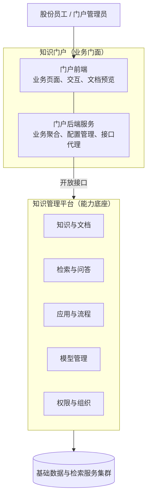
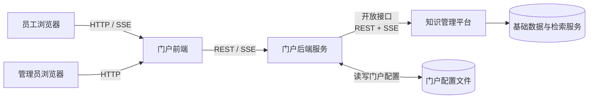
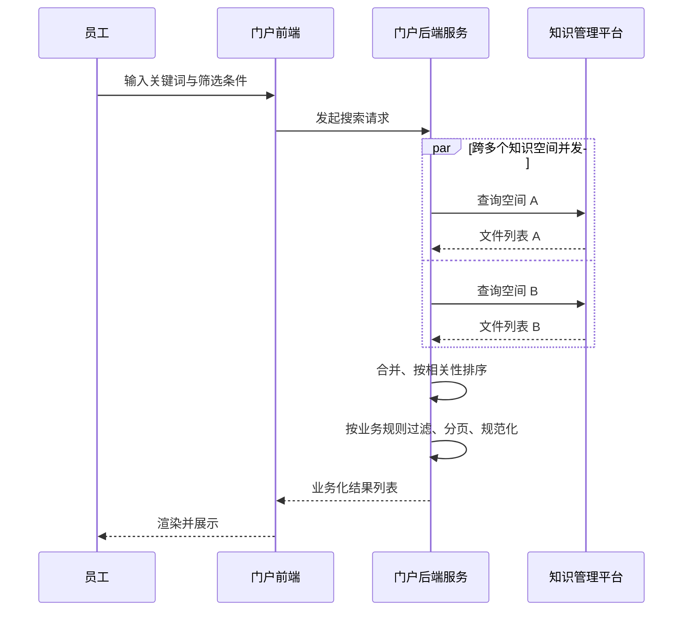
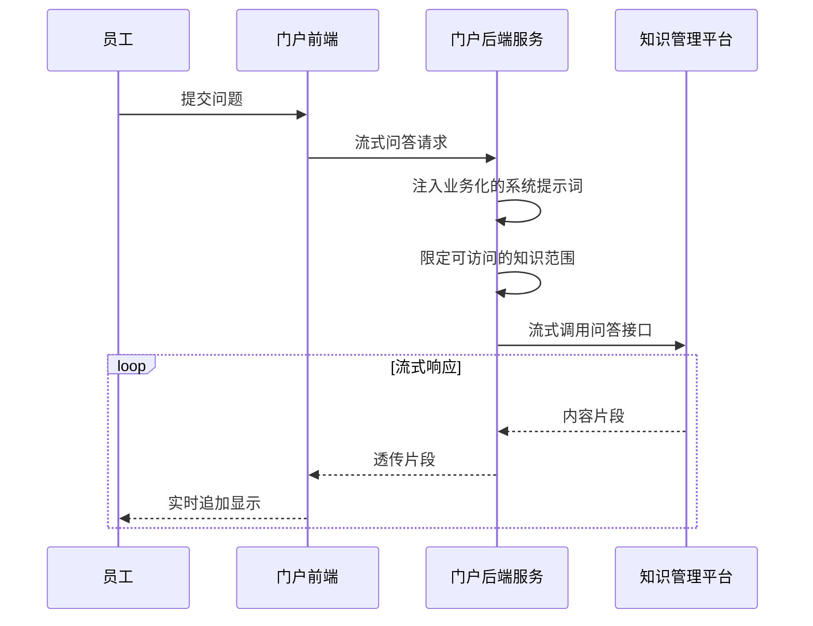
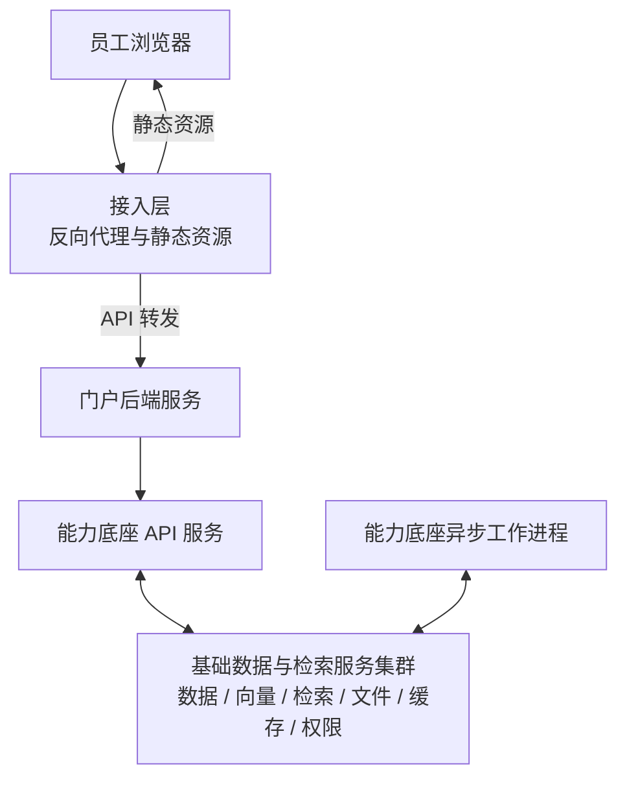

# 首钢股份知识门户 系统架构

## 1. 总体架构

**整体上是上下两层：上层做业务表达，下层做能力沉淀。** 这一分层让"业务变化频繁"和"能力建设需要稳定积累"这两类相互冲突的诉求各得其所。

- **知识门户平台**：员工日常进入企业知识资产的统一入口，提供首页、业务域分类、搜索、文档详情、智能问答与应用集等场景化能力。
- **知识管理平台**：通用的"AI + 知识"能力中台，提供知识库、检索、问答、流程编排、模型管理、权限组织等底层能力。

### 1.2 总体架构图

### 1.4 两层职责边界

| 维度 | 知识门户（门面层） | 知识管理平台（底座层） |
|---|---|---|
| 主要面向 | 股份员工 + 门户管理员 | 知识库管理员 + 部分股份员工 |
| 关注重点 | 体验、定制、品牌一致性 | 能力广度、数据质量、稳定性 |
| 变更频率 | 高（业务调整随时进行） | 低（按版本节奏迭代） |
| 内容举例 | 首页轮播、业务域、应用入口、问答提示词 | 知识库内容、模型接入、流程定义、权限模型 |
| 数据持久化 | 仅少量配置型数据 | 全量业务数据 |
| 升级影响范围 | 仅门户体验，不影响数据 | 全平台与所有上层应用 |

---

## 2. 知识门户

**门户层承担"业务表达"，把通用的 AI 与知识能力包装成符合首钢员工日常工作语境的入口。** 它不持有业务数据，所有的知识、模型、问答能力都来自下层平台。

### 2.1 定位与目标

门户层的设计目标有三条，按优先级排列：

1. **业务可读**：首页、业务域、文档分类、提问语境都贴合首钢内部话语体系，员工无须接受技术化术语。
2. **管理员可改**：所有业务表达层的内容都能在管理后台维护，不需要研发介入。
3. **轻量可演进**：保持轻量的技术形态，便于后续衍生出移动端、岗位定制工作台等多个变体。

### 2.2 面向员工的核心场景

门户聚焦员工"找知识、看知识、用知识"的完整链路：

- **首页**：分模块呈现业务域入口、知识空间概览、热门标签、推荐文档与常用应用集，承担"导览 + 推荐"双重作用。
- **业务域浏览**：以业务条线（如"轧线 / 装备 / 能源 / 冷连轧"等）作为顶层分类，员工可按本职工作所在条线快速进入相关知识。
- **全局搜索**：支持关键词查询，并可叠加标签、业务域、文件类型等多维筛选；命中结果支持按相关性或更新时间排序，并可附 AI 摘要。
- **文档详情**：在线预览常见文档格式（PDF、Word、电子表格、Markdown 等），同时提供分块阅读视图与基于标签的相关推荐，帮助员工"读懂一篇 + 顺藤摸瓜"。
- **智能问答**：以多轮对话方式提问，系统结合所选知识范围给出流式回答，支持多个会话并行。
- **应用集**：作为统一入口，集中收纳第三方业务工具的访问入口，避免员工记忆多个分散网址。

### 2.3 面向管理员的配置能力

门户内置完整的管理后台，**业务侧管理员无须研发协助即可完成日常运营**：

- 挂载与启停知识空间、定义业务域分组、编辑首页内容分区
- 选择问答模型、配置不同场景下的系统提示词、限定问答可用的知识范围
- 调整推荐策略、列表分页规则、应用市场条目
- 维护与底层能力平台的连接信息（地址、凭证、超时等），全部支持在线修改

### 2.4 技术形态简述

门户在工程上由两部分组成，整体形态轻量：

- **门户前端**：基于现代化前端框架（React + Vite + TypeScript）开发的单页应用，承担页面渲染、文档预览与交互体验。
- **门户后端服务（BFF, Backend-for-Frontend）**：一个轻量 Python 服务，承担"业务聚合 + 配置管理 + 接口代理"三类职责，**自身不持久化业务数据**，配置以文件形式落盘。

---

## 3. 知识管理平台（能力底座）

### 3.1 定位与目标

能力底座聚焦"沉淀通用能力、保障稳定可用、支持多业务复用"。它的关键价值在于：

- **能力共建复用**：知识、模型、流程一次接入，多处使用，避免每个业务系统重复造轮子。
- **数据集中可控**：所有知识资产、对话记录、权限关系都集中在平台一侧管理，便于审计、备份、合规。
- **演进面向未来**：可以接入更多大模型、更多检索能力、更多应用模式，业务侧无须感知底层技术变化。

### 3.2 五大能力域

平台的能力被划分为以下五个领域，分工互不重叠：

1. **知识与文档管理**——知识空间组织、文档上传与解析、自动分块、标签与版本管理。
2. **检索与问答**——基于向量检索与全文检索的混合召回，结合大模型生成 RAG 回答，支持流式输出。
3. **应用与流程编排**——以可视化流程编辑器组合知识、模型、外部工具，构建复杂业务应用与智能体助手。
4. **模型管理**——统一接入与管理多家大语言模型供应商，支持按场景切换与配置。
5. **权限与组织**——用户、部门、角色、资源级授权，并支持多组织隔离，可承载集团多子公司同台部署。

### 3.3 数据与检索基础设施

平台底层依托**关系数据库、向量检索服务、全文检索服务、对象存储、缓存与权限服务**等基础组件，按数据特性分别承载结构化数据、向量索引、文档全文、附件文件、热数据缓存与权限关系。

---

## 4. 集成与数据流

**门户层不直接持有业务数据，所有能力都通过开放接口从能力底座获取，门户只做"业务聚合 + 体验定制"。** 这是双层架构能够清晰解耦的关键。

### 4.1 调用关系总图

### 4.2 鉴权与会话

- **员工 → 门户**：当前阶段门户通过发放账号密码使用；后续将与首钢统一身份对接，实现单点登录。
- **门户后端 → 能力底座**：使用平台颁发的访问凭证进行鉴权，凭证由门户管理员在管理后台维护，**支持安全更新与失效重发**。

### 4.3 典型业务流：知识搜索

员工的一次搜索请求，是这样在系统里流转的：

### 4.4 典型业务流：智能问答

智能问答采用流式响应，员工感受到的是"边输出边显示"的实时体验：

要点：门户后端在请求转发前会**注入"首钢知识门户技术问答助手"角色提示词**，并按管理员配置过滤掉不允许参与问答的知识空间——平台侧不感知这些业务规则。

### 4.5 门户层的"业务化加工"

门户后端不是简单的请求透传层，它在以下几个方面做了关键加工：

- **跨知识空间聚合**：把多个空间的查询结果合成单一列表
- **按相关性自定义排序**：依据标题/摘要/标签的命中位置打分，弥补底层接口的不足
- **业务规则过滤**：仅保留启用状态、合规文件类型的内容
- **数据模型规范化**：把底层接口的字段命名、分页参数转成对前端友好的统一格式
- **提示词与知识范围注入**：让问答自动带上业务语境，员工无须自己写复杂的提示
- **预览资源代理**：文件预览所需的临时资源由门户后端代为获取，避免跨域问题
- **预览任务结果短期缓存**：减少对底层平台的重复轮询

---

## 5. 部署与运行环境

**整套系统按"门户层 + 能力底座 + 基础设施"三段部署，相互独立、按需扩展。** 门户层升级与底座升级解耦，互不影响。

### 5.1 部署拓扑

### 5.2 运行组件清单

整套系统在运行时由如下几类组件构成：

| 组件 | 职责 | 部署形态 |
|---|---|---|
| 接入层 | 静态资源托管 + 反向代理 + 域名接入 | Web 服务器 |
| 门户前端 | 静态资源（构建产物） | 由接入层托管 |
| 门户后端服务 | 业务聚合、配置管理、接口代理 | 单进程轻量服务 |
| 能力底座 API 服务 | 同步处理在线请求 | 多进程，支持水平扩展 |
| 能力底座异步工作进程 | 文档解析、向量构建、定时任务等 | 多种工作类型，按队列分组 |
| 基础数据与检索服务集群 | 数据持久化、向量与全文检索、文件存储、缓存、权限关系 | 容器化集群部署 |

